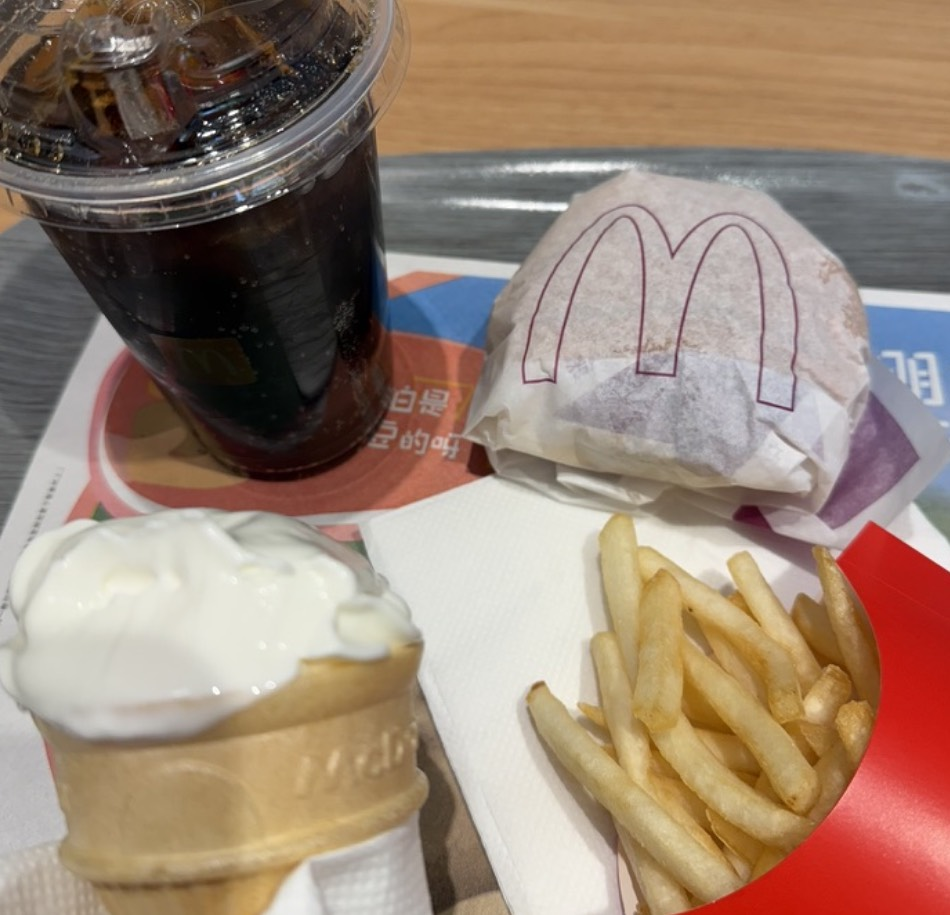

2025年7月15日，星期二，今天我在天门市，气温是36°C，多云

下一次爱情来的时候 - 蔡健雅 - 单曲 - 网易云音乐

⸻

我现在坐在麦当劳。
空调呼啦呼啦地吹，很惬意
窗外的阳光被玻璃切成一块块静止的光斑，
人来人往，却听不见太多声音。
我刷着手机，想着整理一下脑子里漂浮的小念头。

关于做 App 的事。
其实很多时候，我并不觉得自己是在“开发”一款产品，
更像是在做一场自言自语的拼图游戏。
没有用户的回音，也没有市场的回应，
只有我一个人，不紧不慢地把一块块代码凑成形状。

当然，也不是没烦恼。
一个人做 App，说实话，很难。
下载量不多，付费用户更少，
一个月下来，也就算挣点小钱，
不算多，但也刚好够生活里某些琐碎小支出

不过我没停下来。
一边做新产品，一边学点新东西，
说不上是为了什么伟大的目标，
就是想看看，自己能不能再多做一点。
有时候会幻想：
会不会下一个 App 就突然爆了？
但我也知道，那大概率只是想象而已。

事情太多了，琐碎得像地上的灰尘，
怎么扫都扫不干净。
写个 TODO 清单，一列就是十几项，
光是看着就想关掉电脑，但最后还是一个个去做了。
不是因为有多大的野心，
只是因为既然开始了，就想把它好好做完。

我记得我最早做 App，是在一个类似今天的下午。
刷到一些视频，看了几个帖子，心里突然有种冲动，
就像是走在街上，突然想吃甜甜圈一样。
然后我动手做了一个。
没想到那篇小红书的内容居然被推了出去，
有人留言、有人下载，我也就每天更新、每天修改。
过了两三个月，那个 App 居然把年费挣回来了，

现在偶尔上线一个新产品，
也还是会有人提建议，问功能。
我总是想，为什么我上线前没有想到？
但也觉得，这大概就是人与人的不同吧。
有人能看到你没看到的东西，
这不正是做产品最奇妙的地方吗？

我现在也变了不少。
以前我不喜欢看长文，看小说会头疼，
但我却喜欢做笔记、写备忘录，
文字一个个堆在云盘里，像没寄出去的信。
我也不知道自己为什么会这样，
可能人本来就是这样复杂又古怪的动物，
一边抗拒文字，一边又用文字记录生活。

耳机和手机电量也告急了，
买杯喝的
准备回去了。
⸻

爱，很简单 - 陶喆 - 单曲 - 网易云音乐
